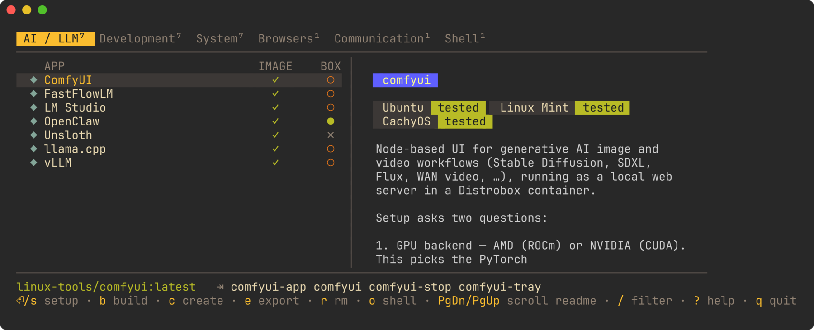
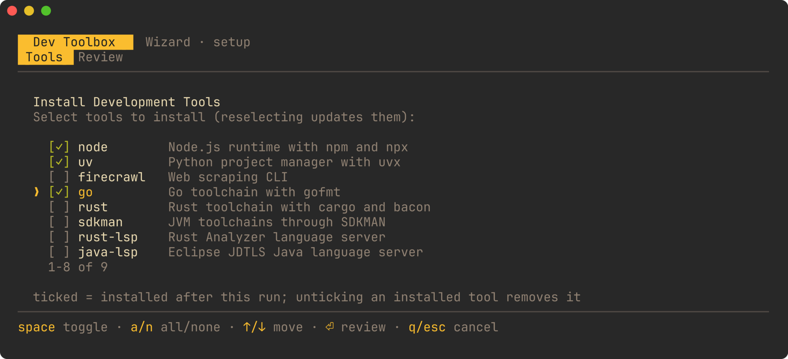
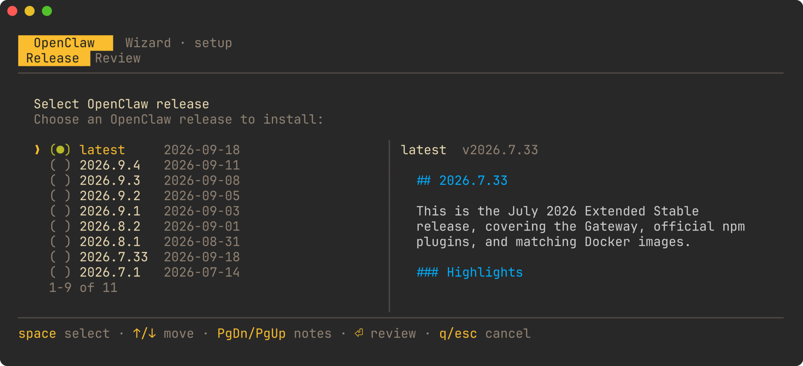
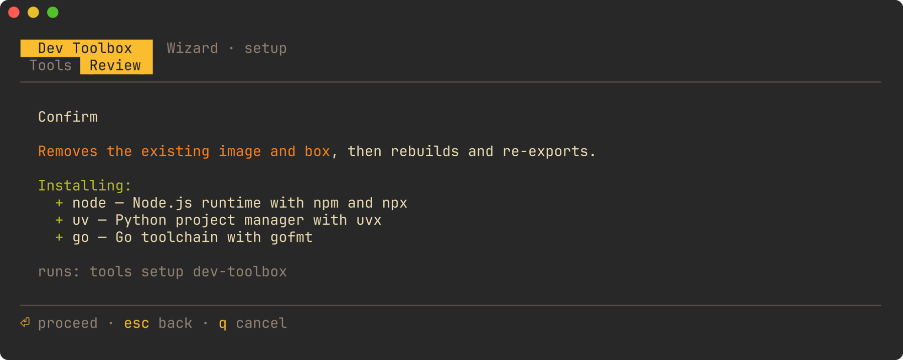

# linux-tools

Install Linux apps into [Distrobox](https://distrobox.it/) containers and use them as if they were installed normally — same entry in your application menu, same command on your `PATH` — while the host stays clean. Each app is one directory in `apps/`, and one command sets it up.



## Quick start

You need [Distrobox](https://distrobox.it/#installation) and [Podman](https://podman.io/docs/installation) on the host (Docker works too).

```bash
git clone https://github.com/zeddius1983/linux-tools.git
cd linux-tools
./tools.sh install   # symlink `tools` into ~/.local/bin, add shell completion, build the dashboard
source ~/.bashrc     # or ~/.zshrc
tools                # open the dashboard
```

Move with `↑`/`↓`, switch category with `tab`, press **⏎** to install the selected app, and `?` for the full key list. Prefer the command line? `tools setup claude-code` does the same thing.

The first setup of an app pulls a base image and builds it, so give it a few minutes. When it finishes, the app is in your application menu and its commands are on your `PATH` — `claude`, `codex`, `nvtop`, whatever that app exports.

## What a setup looks like

Apps with choices ask them first. Nothing is built, removed or installed until you confirm on the last screen.

**1. Pick what goes in the box.** Ticked is what will be there when the run finishes — unticking something already installed removes it.



**2. Pick a version, and see what changed.** Release pickers list the upstream releases with their dates and show the selected release's GitHub notes beside them (`PgDn`/`PgUp` scrolls).



**3. Review, then go.** The last screen spells out what will be added, what will be removed, and the command it is about to run.



## Apps

`tools setup <name>` installs any of these. Names linked below have their own docs page with usage, storage paths and GPU notes.

Each docs page opens with compatibility badges saying which distros that app has
actually been run on. They show as badges here on GitHub and as coloured pills in
the dashboard's README panel:

<p>
  
  
  
  
</p>

Everything here is developed and tested on **Ubuntu-family** hosts, Linux Mint in
particular, so those two are green everywhere. A green **CachyOS** badge means the
app has also been exercised on an Arch-family host; a grey one means it has not —
it may well work, but nothing is promised. Nothing is deliberately Ubuntu-only, so
reports from other distros are welcome.

### AI / LLM

| App | What it is |
|---|---|
| [`comfyui`](apps/comfyui/README.md) | Node-based UI for image and video generation (AMD or NVIDIA) |
| [`fastflowlm`](apps/fastflowlm/README.md) | LLM runtime for the AMD Ryzen AI NPU |
| [`llama-cpp-rocm`](apps/llama-cpp-rocm/README.md) | llama.cpp built for ROCm + Vulkan |
| [`lmstudio`](apps/lmstudio/README.md) | LM Studio desktop app (AMD or NVIDIA) |
| [`openclaw`](apps/openclaw/README.md) | Personal AI agent — a gateway daemon and its CLI, or a node paired to someone else's gateway |
| [`unsloth`](apps/unsloth/README.md) | LLM fine-tuning on ROCm |
| `vllm` | vLLM inference server |

### Development

| App | What it is |
|---|---|
| [`claude-code`](apps/claude-code/README.md) | Anthropic's Claude Code CLI |
| [`codex-cli`](apps/codex-cli/README.md) | OpenAI Codex CLI |
| `copilot-cli` | GitHub Copilot CLI |
| `opencode` | OpenCode agent CLI |
| `antigravity` | Antigravity CLI (`agy`) |
| [`dev-toolbox`](apps/dev-toolbox/README.md) | Node, Python, Go, Rust, JVM toolchains and language servers, pick-and-mix |
| [`jetbrains-toolbox`](apps/jetbrains-toolbox/README.md) | JetBrains Toolbox app |

### System

| App | What it is |
|---|---|
| `amdgpu_top` | AMD GPU monitor |
| [`corefreq`](apps/corefreq/README.md) | CPU monitor with a kernel module built against your host kernel |
| [`nvtop`](apps/nvtop/README.md) | GPU process monitor |
| [`nvbandwidth`](apps/nvbandwidth/README.md) | NVIDIA GPU/NVLink bandwidth test |
| [`nvidia-p2p-driver`](apps/nvidia-p2p-driver/README.md) | NVIDIA GeForce peer-to-peer module |
| [`nvidia-cdi-service`](apps/nvidia-cdi-service/README.md) | Regenerates the NVIDIA CDI spec on the host *(host install, no container)* |
| [`nvidia-acs-service`](apps/nvidia-acs-service/README.md) | Disables PCIe ACS for GPU peer-to-peer *(host install, no container)* |

### Browsers, chat and shell

| App | What it is |
|---|---|
| `chrome` | Google Chrome |
| `telegram` | Telegram Desktop |
| [`shell-toolbox`](apps/shell-toolbox/README.md) | Zsh, Starship and friends *(host install, no container)* |

## Everyday commands

```bash
tools                # dashboard (same as ./tools.sh)
tools setup <app>    # install, or reinstall from scratch
tools list           # what is built, what is running
tools enter <app>    # shell inside the app's container
tools rm <app>       # remove the container and its shortcuts (the built image is kept)
```

There is also `tools build`, `tools create` and `tools export` when you want a single step of a setup — `tools export` is the one to rerun after changing what an app exposes to the host. `make setup-<app>` and friends wrap the same commands.

## Good to know

- **Rerunning `tools setup <app>` is how you update or reconfigure it.** It removes the old image and box first, so it is a rebuild, not a repair. Answers you gave the wizard last time are asked again — that is how you switch a GPU backend or move to a newer release.
- **Your home directory is shared with every container.** Config and data written to `~/` are still there after a rebuild, and are visible to the host. Anything inside the container's own filesystem is not.
- **App windows may not appear in the menu until you log out and back in**, the first time.
- **`tools rm <app>` keeps the image**, so putting the app back is fast. To reclaim the disk, remove the image with `podman rmi linux-tools/<app>:latest`.
- **A container is a normal Distrobox**, named `<app>-box`: `distrobox enter comfyui-box` works exactly as you would expect.
- **No Go, no dashboard, no problem.** `tools.sh install` builds the dashboard with host Go if you have it, otherwise in a throwaway container, and skips it harmlessly if neither is available — the older `whiptail` menu takes over. `LT_NO_GO_TUI=1 tools` selects that menu deliberately.
- The dashboard's full key reference lives in [`tui/README.md`](tui/README.md).

## Adding your own app

Create `apps/<name>/` with four files — no registration step, `tools` discovers it:

| File | What it is |
|---|---|
| `Dockerfile` | the image, usually a base image plus a package install |
| `exports` | what to put on the host: `bin:mytool`, `gui:myapp:My App`, one per line |
| `description` | the short label the dashboard shows |
| `README.md` | usage docs, rendered in the dashboard beside the app table |

Then `tools setup <name>`. Optional extras — a bundled icon, extra container flags, a setup wizard, a host-only installer — are documented with the export types, base-image choices and known pitfalls in [`CLAUDE.md`](CLAUDE.md); the dashboard's own design notes are in [`tui/README.md`](tui/README.md) and [`docs/tui-migration.md`](docs/tui-migration.md).

Screenshots in this README are generated by [`scripts/screenshots.sh`](scripts/screenshots.sh), which renders them from the dashboard itself.

## Testing on macOS (OrbStack)

[OrbStack](https://orbstack.dev) gives you a Linux VM to try this in:

```bash
orb create ubuntu:24.04 linux-tools-test
orb shell linux-tools-test

git clone git@github.com:zeddius1983/linux-tools.git
cd linux-tools
bash scripts/setup-vm.sh
./tools.sh
```

GUI apps need X11 forwarding from there, so they are easier to check on a real Linux machine.
